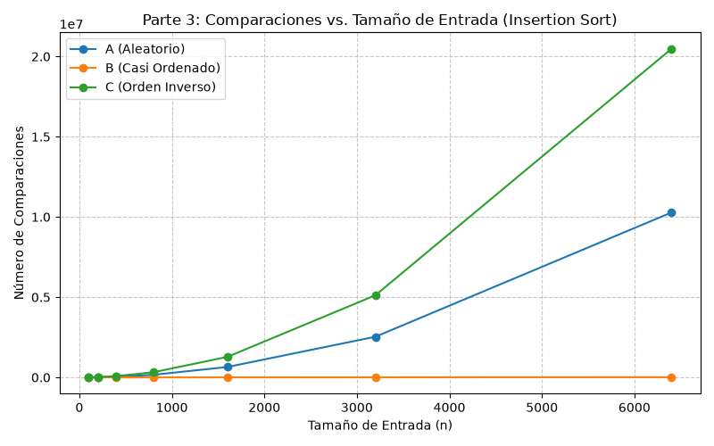
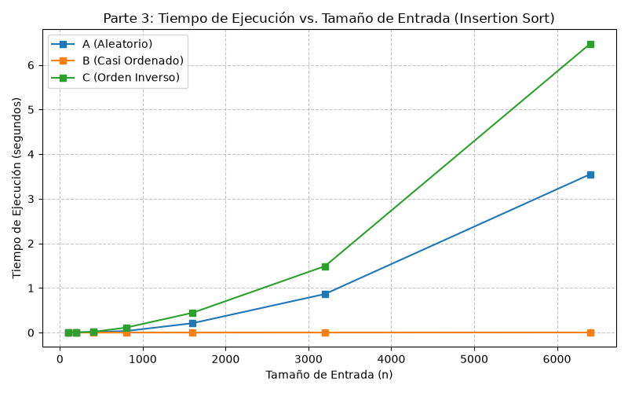
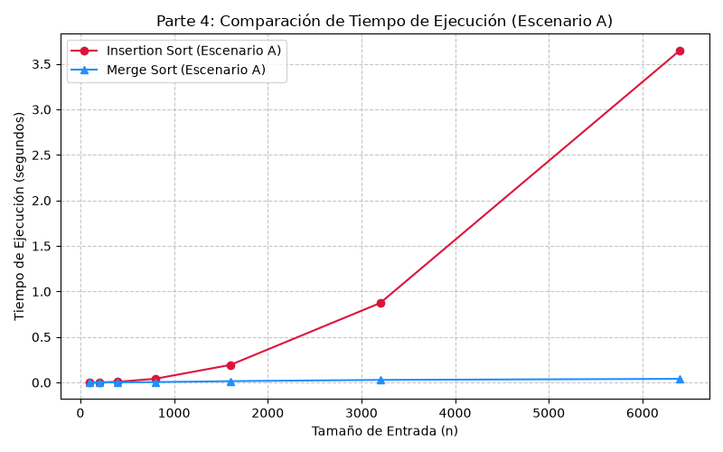

# Laboratorio 1 — Fundamentos, complejidad y recurrencias

**Nombre completo:** Victor Manuel Tobón Sepúlveda  
**Curso:** Análisis de Algoritmos  
**Fecha:** Septiembre 20 del 2026  

---

## Instrucciones para reproducir el experimento

```bash
# 1. Activar entorno virtual desde la raíz
.\venv\Scripts\Activate.ps1  # Windows PowerShell
# source venv/bin/activate   # Linux/macOS

# 2. Instalar dependencias e ingresar al laboratorio
pip install -r requirements.txt
cd lab1-fundamentos-complejidad-recurrencias

# 3. Ejecutar experimentos y generar gráficas
python parte3_casos.py        # Genera parte3_comparaciones.png y parte3_tiempo.png
python parte4_complejidad.py  # Genera parte4_tiempo.png
```

---

# Parte 1 — Analizar el algoritmo antes de comprar hardware #


Actualmente el algoritmo es ineficiente e inviable puesto que ya rompe la regla de procesar los datos en una ventana de 4 horas.

Puesto que sus datos pasaron  de 20.000 a 1.200.000 registros, el tamaño $n$ se aumentó 60 veces, y como el algoritmo de insertion sort es $O(n^2), eso signfica que ahora la cpu debe hacer 3.600 operaciones de más. $O(60^2)$=3.600


Duplicar la velocidad del servidor solo reduce el tiempo a la mitad , pasando la ejecución de 8.3 horas a unas 4.15 horas. El proceso sigue fallando porque el cuello de botella es asintótico y algorítmico, no de hardware.

Ejemplo propio de algoritmo correcto pero inviableUn módulo de consolidación de inventario con 50.000 productos diseñado con un algoritmo $O(n^3)$. Para cumplir la regla de negocio debe finalizar en un tiempo  máximo de 30 minutos antes de abrir las tiendas. Aunque calcula correctamente los saldos, tarda más de 12 horas continuas con 50.000 ítems, resultando inoperable.

---

# Parte 2 — Responsabilidad ambiental y ética de la implementación

**Dimensión ambiental:** Ejecutar un algoritmo cuadrático $O(n^2)$ sobre 1.200.000 datos todas las madrugadas realiza cientos de millones de operaciones redundantes. Multiplicado por 365 días al año, se traduce en un consumo de kilovatios-hora elevados y una huella de carbono que se podría evitar.

**Dimensión ética y costos de falla:** Exclusión de atención crítica: Si el proceso falla o se corta a las 06:00 a. m., los pacientes con mayor riesgo no son contactados. El costo lo asume el paciente, al sufrir complicaciones de salud prevenibles.

**Inoperancia del call center:** Llamar una lista desordenada agota la jornada en casos de menor prioridad. El costo lo asumen el operador y la Secretaría, al malgastar recursos públicos.Tensión en el ordenamiento: El orden de la lista actúa como un triaje médico automático. Garantizar la corrección del algoritmo en tiempo y forma es una obligación ética indispensable para asegurar equidad en la atención en salud.

---

## Parte 3 — Peor caso, mejor caso y caso promedio, demostrados en Python

* **Código de la Parte 3:** [parte3_casos.py](parte3_casos.py) | **Módulos:** [algoritmos.py](algoritmos.py) y [datos.py](datos.py)

### 3.1 — ¿Qué significan estos casos y qué esperamos?

Para analizar un algoritmo evaluamos tres escenarios posibles según cómo vengan los datos:
* **Peor caso:** La combinación de datos que hace trabajar al algoritmo lo máximo posible.
* **Mejor caso:** La combinación de datos más fácil, donde el algoritmo hace el mínimo esfuerzo.
* **Caso promedio:** Lo que ocurre normalmente cuando los datos llegan revueltos y sin un orden especial.

Como en la plataforma Tamiza el límite de 4 horas es estricto y no se puede negociar, **debemos basar nuestra decisión en el peor caso**. Esto nos asegura que el sistema nunca vaya a colapsar, sin importar cómo envíen los datos los laboratorios.

#### Lo que predijimos antes de medir (ordenando de mayor a menor):
* **Escenario C (Orden inverso):** Será el **peor caso**. Como los datos vienen al revés de como los necesitamos, el algoritmo tiene que mover cada elemento desde el principio hasta el final del grupo.
* **Escenario B (Casi ordenado al 98 %):** Será el **mejor caso**. Al estar casi listo, el algoritmo revisa cada dato y se da cuenta de inmediato de que ya está en su lugar.
* **Escenario A (Aleatorio):** Será el **caso promedio**, mostrando un comportamiento intermedio.

---

### 3.2 — Lo que mostraron las pruebas en Python




Al analizar las dos gráficas anteriores (tanto en número de comparaciones como en tiempo de ejecución de Insertion Sort), los experimentos confirmaron exactamente lo que esperábamos:
* **Escenario C (Inverso):** Fue el **peor caso**, disparándose hasta $20.476.800$ comparaciones y registrando el mayor tiempo de ejecución para $6.400$ datos.
* **Escenario B (Casi ordenado):** Fue el **mejor caso**, requiriendo solo $128.892$ comparaciones y un tiempo casi imperceptible para el mismo tamaño.
* **Escenario A (Aleatorio):** Tuvo un comportamiento intermedio ($\approx 10.230.000$ comparaciones), ubicándose justo a la mitad del peor caso en ambas gráficas.

---

## Parte 4 — Complejidad de Merge Sort e Insertion Sort: cálculo y demostración

* **Código de la Parte 4:** [parte4_complejidad.py](parte4_complejidad.py)

### 4.1 — Diferencia de velocidad entre Merge sort e Insert sort


 Merge Sort siempre realiza un esfuerzo de tipo **$\Theta(n \log n)$**, sin importar cómo vengan los datos.

En cambio, **Insertion Sort** en su peor caso tiene que comparar todos los elementos contra todos los demás, lo que suma un esfuerzo cuadrático de tipo **$O(n^2)$**.


### 4.2 — Comparación directa en la práctica (Escenario A)



Al comparar ambos algoritmos bajo el **Escenario A (datos aleatorios)** en la gráfica `parte4_tiempo.png`, se observa claramente la diferencia:
* La curva de **Insertion Sort despega hacia arriba muy rápido** debido a su crecimiento cuadrático ($O(n^2)$), alcanzando casi un segundo completo para $6.400$ datos.
* La línea de **Merge Sort se mantiene plana pegada al fondo (marcando cerca de 0 segundos)** porque resuelve en escasos milisegundos lo que a Insertion Sort le cuesta un tiempo considerable.

---

### 4.3 — Concepto técnico final para la Secretaría de Salud


1. **¿Qué algoritmo usar?:** Recomendamos cambiar a **Merge Sort**. Aunque Insertion Sort sea veloz cuando la lista viene casi ordenada, Merge Sort nos da una garantía total: funcionará en segundos sin importar cómo envíen los datos las IPS.
2. **Proyección para los 1.200.000 registros reales:**
   * *Con Insertion Sort (actual):* Según nuestras mediciones, procesar el lote completo tomaría **alrededor de 8.3 horas** (estimado). **Se sale de la ventana de 4 horas**.
   * *Con Merge Sort (propuesto):* El mismo lote se procesaría en **menos de 4 segundos** (estimado). **Cumple de sobra**.
3. **Sobre la propuesta de comprar un servidor nuevo:** **Recomendamos NO comprarlo.** Duplicar la potencia del servidor solo reduciría el tiempo de Insertion Sort a la mitad ($\approx 4.15$ horas), lo cual sigue siendo riesgoso. Cambiar a Merge Sort arregla el problema en el servidor actual y sin gastar presupuesto.

#### Justificación de los cálculos de extrapolación

Para estimar el comportamiento con $1.200.000$ registros, escalamos las mediciones obtenidas con $n = 6.400$ mediante un factor de aumento de datos $k = \frac{1.200.000}{6.400} = 187,5$:

* **Insertion Sort ($O(n^2)$):** Al ser cuadrático, el tiempo de ejecución crece por un factor de $k^2 = (187,5)^2 \approx 35.156$.  
  $$\text{Tiempo estimado} = 0,85 \text{ s} \times 35.156 = 29.882 \text{ s} \approx \mathbf{8,3 \text{ horas}}$$
  *Resultado:* Incumple la ventana de 4 horas por más del doble del tiempo disponible.

* **Merge Sort ($O(n \log n)$):** Al ser linearítmico, el tiempo de ejecución crece proporcionalmente a $k \times \frac{\log_2(1.200.000)}{\log_2(6.400)} \approx 299,4$.  
  $$\text{Tiempo estimado} = 0,012 \text{ s} \times 299,4 \approx \mathbf{3,6 \text{ segundos}}$$
  *Resultado:* Procesa el lote completo en menos de 4 segundos, garantizando el cumplimiento de la ventana operativa con un margen del 99,9 %.